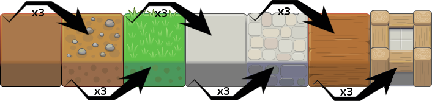
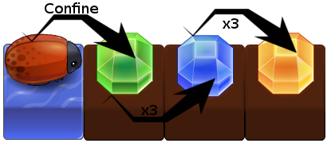

# Triple Match

This game is inspired by [Triple Town](http://www.tripletown.com/) from [Spryfox](http://www.spryfox.com/), so you won't be lost if you played this one before.

There is no way to win, just try to make the higher possible score.

There is two losing conditions :

- Drown the last character
- Fill the game with "non-water" cells. You lose when there is no water left

On each turn, you have to place an item in an empty cell. When you place 3 identical items next to each other, they combine into 1 new item. Thanks to this mechanism, you can prevent the board game from filling.

Each turn you will be presented a new item to place in the "Current" box on the left. Click on the cell where you want to place this item.

The "Stash" under the "Current" box allows you to store an item for later use. Click on the stash to move the current item into the stash (and recover the stashed item).

There is one stash for every character in the game. Just click on a character to see his own "personnal" stash. To help you, every character holds a bubble with the stashed item displayed in it.

# Combination

You can combine 3 or more blocks into a "bigger" one. The order is :

# Annoying Bugs

Sometimes, you have to place "Bugs". Bugs move freely on the board and prevent you from placing items. To kill bugs, just confine them in an area without any free cell. They will then change into green diamond. The diamonds follow the same scheme as blocks :

# Specials

 The "star" is a joker. It matches any other block or diamond. If two or more matches are possible, the "smaller" match will be done.

 The "key" is an eraser. It removes anything.

 This one is just here to block you. All you can do is remove it with the key.

# Little characters

At the beginning, there is only the queen. A new little guy will appear each time you make a match of level 5 or more (wood plank).

They move on every "non water" cell. They can move on diagonals.

For every character in the game, there is a stash. The more character you have, the more items you can store for later use.

Characters drown if they find themselves on a water cell without any possibility to go back "on earth". So be careful when you make a match with a character on it or when you destroy an item with the key.

# Score grid

| When item ... is ... | played | combined | result of combination | destroyed |
|---|---|---|---|---|
|  1 | 5 | 10 | | -5 |
|  2 | 10 | 20 | 30 | -30 |
|  3 | 50 | 50 | 70 | -75 |
|  4 | 200 | 100 | 150 | -200 |
|  5 | | 150 | 500 | -1000 |
|  6 | | 1000 | 2500 | -5000 |
|  7 | | | 10000 | -20000 |
|  -1 | 500 | | | 2000 |
|  -2 | 10 | 100 | | 10 |
|  -3 | 100 | | | |
|  -4 | 250 | | | |
|  -5 | | 500 | 750 | 500 |
|  -6 | | 2500 | 1500 | 1000 |
|  -7 | | | 1500 | 25000 |

# Credits

- Code : [Ghislain "court-jus" Lévêque](http://about.me/courtjus/)
- Inspiration : [Triple Town](http://www.tripletown.com/) from [Spryfox](http://www.spryfox.com/) (I guess it was inspired by older stuff, so I thank them too)
- Graphics : [PlanetCute](https://lostgarden.com/2007/05/12/dancs-miraculously-flexible-game-prototyping-tiles/) from [Lost Garden](http://www.lostgarden.com/)
